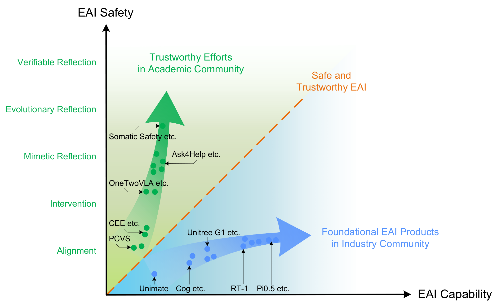
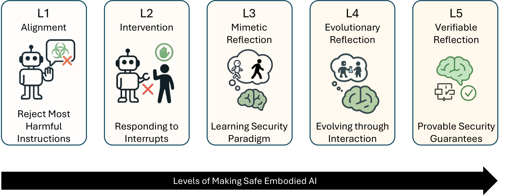

 <h1> Towards Safe and Trustworthy Embodied AI: Foundations, Status, and Prospects </h1>

Xin Tan&ast; [🔗](https://tanxincs.github.io/ "Homepage") · Bangwei Liu&ast; · Yicheng Bao · Qijian Tian · Zhenkun Gao · Xiongbin Wu ·  Zhihao Luo · 
Sen Wang · Yuqi Zhang · Xuhong Wang&dagger; · Chaochao Lu&dagger; [🔗](https://causallu.com/ "Homepage") · Bowen Zhou&dagger; [🔗](https://scholar.google.com/citations?user=h3Nsz6YAAAAJ "Scholar")

**上海人工智能实验室 / Shanghai Artificial Intelligence Laboratory [🔗](https://www.shlab.org.cn/)**  
**华东师范大学 / East China Normal University [🔗](https://www.ecnu.edu.cn/)**  
**清华大学 / Tsinghua University [🔗](https://www.tsinghua.edu.cn/)**  

---

  

    <h3 style="text-align:center;margin:0 0 16px 0;">Abstract</h3>
    

      The increasing autonomy and physical capability of Embodied Artificial Intelligence (EAI) introduce critical
      challenges to safety and trustworthiness. Unlike purely digital AI, failures in perception, planning, or
      interaction can lead to direct physical harm, property damage, or the violation of human safety and social norms.
      However, current EAI foundation models disregard the risks of misalignment between the model capabilities and
      the safety and trustworthiness competencies. Some works attempt to address these issues, however, they lack a
      unified framework capable of balancing the developmental trajectories between safety and capability. In this
      paper, we first comprehensively define a new term <em>safe and trustworthy EAI</em> by establishing an L1–L5 levels
      framework and proposing ten core principles of trustworthiness and safety. To unify fragmented research efforts,
      we propose a novel, agent-centric framework that analyzes risks across the four operational stages of an EAI
      system. We systematically review state-of-the-art but fragmented solutions, benchmarks, and evaluation metrics,
      identifying key gaps and challenges. Finally, we identify the need for a paradigm shift away from optimizing
      isolated components towards a holistic, cybernetic approach. We argue that future progress hinges on engineering
      the closed-loop system of the agent (Self), its environment (World), and their dynamic coupling (Interaction),
      paving the way for the next generation of truly safe and trustworthy EAI.
    

  

  
  
<strong>Figure 1.</strong> Capability–Safety divergence in the Embodied AI landscape

  <h3>Research Motivation</h3>
  

    While embodied AI (EAI) products are rapidly improving in capability, they often lack reliable
    safety mechanisms. In contrast, academic safety research remains fragmented and lags behind in
    capability. This divergence has raised significant concerns about the trustworthiness of physical
    AI systems.To address this gap, we propose a unified research framework that integrates capability advancement
    and trustworthy safety, paving the way for the development of safe and aligned embodied agents.
  

    

  <h3 style="margin:0 0 6px 0;">The Five Levels of “Make Safe EAI”</h3>
  

    We chart the progression from <strong>Resistance (L1–L2)</strong> to <strong>Resilience (L3–L5)</strong>,
    moving from refusal and oversight to adaptive learning and verifiable guarantees.
  

  
  
<strong>Figure 2.</strong> From Resistance (L1–L2) to Resilience (L3–L5)

  

    
L1 — Alignment (Foundational Resistance)

    <ul style="margin:0;padding-left:18px;">
      <li><b>Goal:</b> Refuse harmful instructions; follow basic safety norms.</li>
      <li><b>How:</b> Instruction tuning, RLHF, safety filters, red-teaming data.</li>
      <li><b>Limit:</b> Correlation-based; vulnerable to jailbreaks and shifts.</li>
    </ul>
  

  

    
L2 — Intervention (Oversight-based Resistance)

    <ul style="margin:0;padding-left:18px;">
      <li><b>Goal:</b> Let humans halt/redirect <em>before</em> risky actions.</li>
      <li><b>How:</b> Interrupt channels, intent/plan display, trajectory visualization.</li>
      <li><b>Limit:</b> Needs constant oversight; weak scalability to high autonomy.</li>
    </ul>
  

  

    
L3 — Mimetic Reflection (Foundational Resilience)

    <ul style="margin:0;padding-left:18px;">
      <li><b>Goal:</b> Internalize validated safe behaviors.</li>
      <li><b>How:</b> Imitation learning, behavior cloning, curated safety playbooks.</li>
      <li><b>Limit:</b> Limited generalization to novel tasks and combinations.</li>
    </ul>
  

  

    
L4 — Evolutionary Reflection (Adaptive Resilience)

    <ul style="margin:0;padding-left:18px;">
      <li><b>Goal:</b> Continual self-improvement; proactive patching.</li>
      <li><b>How:</b> Continual learning, self red-teaming, safety-aware exploration.</li>
      <li><b>Limit:</b> Empirical assurance only — no prior formal guarantees.</li>
    </ul>
  

  

    
L5 — Verifiable Reflection (Guaranteed Resilience)

    <ul style="margin:0;padding-left:18px;">
      <li><b>Goal:</b> Provable safety/stability of closed-loop behavior.</li>
      <li><b>How:</b> Reachability/invariance analysis, control-theoretic synthesis, neuro-symbolic proofs.</li>
      <li><b>Limit:</b> Model/compute-intensive; engineering maturity evolving.</li>
    </ul>
  

 <h1> Reference </h1>

- [Instruction Understanding](#instruction-understanding)
  - [Abuse Prevention](#abuse-prevention)
  - [Accuracy](#accuracy)
  - [Attack Resistance](#attack-resistance)
  - [Privacy Protection](#privacy-protection)
  - [Reliability](#reliability)
  - [Value Alignment](#value-alignment)
- [Environment Perception](#environment-perception)
  - [Abuse Prevention](#abuse-prevention-1)
  - [Accuracy](#accuracy-1)
  - [Attack Resistance](#attack-resistance-1)
  - [Auditability](#auditability)
  - [Explainability](#explainability)
  - [Privacy Protection](#privacy-protection-1)
  - [Reliability](#reliability-1)
  - [Value Alignment](#value-alignment-1)
- [Physical Interaction](#physical-interaction)
  - [Abuse Prevention](#abuse-prevention-2)
  - [Attack Resistance](#attack-resistance-2)
  - [Controllability](#controllability)
  - [Privacy Protection](#privacy-protection-2)
  - [Reliability](#reliability-2)
  - [Value Alignment](#value-alignment-2)
- [Action Planning](#action-planning)
  - [Accuracy](#accuracy-2)
  - [Attack Resistance](#attack-resistance-3)
  - [Auditability](#auditability-1)
  - [Controllability](#controllability-1)
  - [Explainability](#explainability-1)
  - [Privacy Protection](#privacy-protection-3)
  - [Reliability](#reliability-3)
  - [Value Alignment](#value-alignment-3)

## Instruction Understanding

### Abuse Prevention

- **Plug in the Safety Chip: Enforcing Constraints for LLM-driven Robot Agents** (23.09) [🔗](https://arxiv.org/abs/2309.09919)

### Accuracy

- **A Model-Agnostic Approach for Semantically Driven Disambiguation in Human-Robot Interaction** (Fethiye Irmak Dogan, 25.04) [🔗](https://arxiv.org/abs/2409.17004)
- **DoRO: Disambiguation of Referred Object for Embodied Agents** (Pradip Pramanick, 22.1) [🔗](https://ieeexplore.ieee.org/abstract/document/9846930)
- **Embodied Multi-Agent Task Planning from Ambiguous Instruction** (Xinzhu Liu, 22.06) [🔗](https://web.archive.org/web/20220704170254id_/http://www.roboticsproceedings.org/rss18/p032.pdf)
- **Grounding Multimodal LLMs to Embodied Agents that Ask for Help with Reinforcement Learning** (Ram Ramrakhya, 25.04) [🔗](https://arxiv.org/abs/2504.00907)
- **Improving Grounded Natural Language Understanding through Human-Robot Dialog** (Jesse Thomason, 19.05) [🔗](https://ieeexplore.ieee.org/abstract/document/8794287)
- **Inner Monologue: Embodied Reasoning through Planning with Language Models** (22.07) [🔗](https://arxiv.org/abs/2207.05608)
- **Integrating Disambiguation and User Preferences into Large Language Models for Robot Motion Planning** (Mohammed Abugurain, 24.04) [🔗](https://arxiv.org/abs/2404.14547)
- **NarraGuide: an LLM-based Narrative Mobile Robot for Remote Place Exploration** (25.08) [🔗](https://www.arxiv.org/abs/2508.01235)
- **Navigation as Attackers Wish? Towards Building Robust Embodied Agents under Federated Learning** (Yunchao Zhang, 22.11) [🔗](https://arxiv.org/abs/2211.14769)
- **Open-Ended Instructable Embodied Agents with Memory-Augmented Large Language Models** (23.1) [🔗](https://arxiv.org/abs/2310.15127)
- **ThinkBot: Embodied Instruction Following with Thought Chain Reasoning** (23.12) [🔗](https://arxiv.org/abs/2312.07062)
- **tagE: Enabling an Embodied Agent to Understand Human Instructions** (23.1) [🔗](https://arxiv.org/abs/2310.15605)

### Attack Resistance

- **AGENTSAFE: Benchmarking the Safety of Embodied Agents on Hazardous Instructions** (Aishan Liu, 25.06) [🔗](https://arxiv.org/abs/2506.14697)
- **Advancing Embodied Agent Security: From Safety Benchmarks to Input Moderation** (Ning Wang, 25.04) [🔗](https://arxiv.org/abs/2504.15699)
- **Adversarial Attacks on Robotic Vision Language Action Models** (Eliot Krzysztof Jones, 25.06) [🔗](https://arxiv.org/abs/2506.03350)
- **Adversarial Training for Multimodal Large Language Models against Jailbreak Attacks** (Liming Lu, 25.03) [🔗](https://arxiv.org/abs/2503.04833)
- **BadNAVer: Exploring Jailbreak Attacks On Vision-and-Language Navigation** (Wenqi Lyu, 25.05) [🔗](https://arxiv.org/abs/2505.12443)
- **Concept Enhancement Engineering: A Lightweight and Efficient Robust Defense Against Jailbreak Attacks in Embodied AI** (Jirui Yang; Zheyu Lin, 25.04) [🔗](https://arxiv.org/abs/2504.13201)
- **Jailbreaking LLM-Controlled Robots** (Alexander Robey, 24.1) [🔗](https://arxiv.org/abs/2410.13691)
- **MM-SafetyBench: A Benchmark for Safety Evaluation of Multimodal Large Language Models** (Xin Liu, 23.11) [🔗](https://arxiv.org/abs/2311.17600)
- **POEX: Understanding and Mitigating Policy Executable Jailbreak Attacks against Embodied AI** (Xuancun Lu, 24.12) [🔗](https://arxiv.org/abs/2412.16633)
- **Towards Robust Multimodal Large Language Models Against Jailbreak Attacks** (Ziyi Yin, 25.02) [🔗](https://arxiv.org/abs/2502.00653)

### Privacy Protection

- **Security Considerations in AI-Robotics: A Survey of Current Methods, Challenges, and Opportunities** (23.1) [🔗](https://arxiv.org/abs/2310.08565)

### Reliability

- **Embodied Instruction Following in Unknown Environments** (25.07) [🔗](https://www.arxiv.org/pdf/2406.11818)
- **LACMA: Language-Aligning Contrastive Learning with Meta-Actions for Embodied Instruction Following** (23.1) [🔗](https://arxiv.org/abs/2310.12344)
- **Semantic Skill Grounding for Embodied Instruction-Following in Cross-Domain Environments** (24.08) [🔗](https://arxiv.org/abs/2408.01024)
- **Verifiably Following Complex Robot Instructions with Foundation Models** (24.02) [🔗](https://arxiv.org/abs/2402.11498)

### Value Alignment

- **LLM-Driven Robots Risk Enacting Discrimination, Violence, and Unlawful Actions** (24.06) [🔗](https://arxiv.org/abs/2406.08824)

## Environment Perception

### Abuse Prevention

- **A Survey on Adversarial Robustness of LiDAR-based Machine Learning Perception in Autonomous Vehicles** (Junae Kim, 24.11) [🔗](https://arxiv.org/pdf/2411.13778v1)
- **Adversarial Attacks and Detection in Visual Place Recognition for Safer Robot Navigation** (Connor Malone, 25.01) [🔗](https://arxiv.org/pdf/2506.15988)
- **BadDepth: Backdoor Attacks Against Monocular Depth Estimation in the Physical World** (Ji Guo, 25.05) [🔗](https://arxiv.org/pdf/2505.16154)
- **Embodied Active Defense: Leveraging Recurrent Feedback to Counter Adversarial Patches** (24.03) [🔗](https://arxiv.org/abs/2404.00540)
- **Embodied Laser Attack:Leveraging Scene Priors to Achieve Agent-based Robust Non-contact Attacks** (24.07) [🔗](https://arxiv.org/abs/2312.09554)
- **Random Spoofing Attack against Scan Matching Algorithm SLAM (Long)** (24.02) [🔗](https://www.ndss-symposium.org/ndss-paper/auto-draft-476/)
- **SLAMSpoof: Practical LiDAR Spoofing Attacks on Localization Systems Guided by Scan Matching Vulnerability Analysis** (Rokuto Nagata, 25.02) [🔗](https://arxiv.org/html/2502.13641v1)
- **SoK: Rethinking Sensor Spoofing Attacks against Robotic Vehicles from a Systematic View** (23.07) [🔗](https://arxiv.org/abs/2205.04662)
- **Towards Robust and Secure Embodied AI: A Survey on Vulnerabilities and Attacks** (WENPENG XING, 25.02) [🔗](https://arxiv.org/pdf/2502.13175)

### Accuracy

- **Active SLAM With Dynamic Viewpoint Optimization for Robust Visual Navigation** (Peng Li, 25.06) [🔗](https://ieeexplore.ieee.org/abstract/document/11037221)
- **Embodied Uncertainty-Aware Object Segmentation** (fang2024embodied, 24.1) [🔗](https://ieeexplore.ieee.org/abstract/document/10801562)
- **Embodied active domain adaptation for semantic segmentation via informative path planning** (René Zurbrügg, 22.1) [🔗](https://ieeexplore.ieee.org/abstract/document/9816133)
- **Embodied visual active learning for semantic segmentation** (David Nilsson, 21.12) [🔗](https://ojs.aaai.org/index.php/AAAI/article/view/16338)
- **Embodiedgpt: Vision-language pre-training via embodied chain of thought** (Yao Mu, 23.05) [🔗](https://proceedings.neurips.cc/paper_files/paper/2023/file/4ec43957eda1126ad4887995d05fae3b-Paper-Conference.pdf)
- **Embodiedscan: A holistic multi-modal 3d perception suite towards embodied ai** (Tai Wang, 24.03) [🔗](https://openaccess.thecvf.com/content/CVPR2024/html/Wang_EmbodiedScan_A_Holistic_Multi-Modal_3D_Perception_Suite_Towards_Embodied_AI_CVPR_2024_paper.html)
- **Enhancing embodied object detection through language-image pre-training and implicit object memory** (Nicolas Harvey Chapman, 24.02) [🔗](https://arxiv.org/pdf/2402.03721)
- **Interactron: Embodied adaptive object detection** (Klemen Kotar, 22.03) [🔗](https://openaccess.thecvf.com/content/CVPR2022/papers/Kotar_Interactron_Embodied_Adaptive_Object_Detection_CVPR_2022_paper.pdf)
- **Learn how to see: collaborative embodied learning for object detection and camera adjusting** (Lingdong Shen, 24.03) [🔗](https://ojs.aaai.org/index.php/AAAI/article/view/28281)
- **Learning robust perceptive locomotion for quadrupedal robots in the wild** (TAKAHIRO MIKI, 22.01) [🔗](https://arxiv.org/abs/2201.08117)
- **Learning to Walk by Steering: Perceptive Quadrupedal Locomotion in Dynamic Environments** (Mingyo Seo, 22.09) [🔗](https://arxiv.org/abs/2209.09233)
- **Legged locomotion in challenging terrains using egocentric vision** (Ananye Agarwal, 22.11) [🔗](https://proceedings.mlr.press/v205/agarwal23a.html)
- **Move to see better: Self-improving embodied object detection** (Zhaoyuan Fang, 20.12) [🔗](https://www.bmvc2021-virtualconference.com/assets/papers/0615.pdf)
- **Obstacle-Aware Quadrupedal Locomotion With Resilient Multi-Modal Reinforcement Learning** (I Made Aswin Nahrendra, 24.09) [🔗](https://arxiv.org/abs/2409.19709)
- **Openvla: An open-source vision-language-action model** (Moo Jin Kim, 24.06) [🔗](https://arxiv.org/abs/2406.09246)
- **Palm-e: An embodied multimodal language model** (Danny Driess, 23.07) [🔗](https://dl.acm.org/doi/abs/10.5555/3618408.3618748)
- **Perception Matters: Enhancing Embodied AI with Uncertainty-Aware Semantic Segmentation** (Sai Prasanna, 24.08) [🔗](https://arxiv.org/pdf/2408.02297)
- **RT-2: Vision-Language-Action Models Transfer Web Knowledge to Robotic Control** (23.07) [🔗](https://proceedings.mlr.press/v229/zitkovich23a.html)
- **Resilient Legged Local Navigation: Learning to Traverse with Compromised Perception End-to-End** (Jin Jin, 23.1) [🔗](https://ieeexplore.ieee.org/abstract/document/10611254)
- **Robot Manipulation Based on Embodied Visual Perception: A Survey** (Sicheng Wang, 25.06) [🔗](https://ietresearch.onlinelibrary.wiley.com/doi/full/10.1049/cit2.70022)
- **Robustnav: Towards benchmarking robustness in embodied navigation** (Prithvijit Chattopadhyay, 21.06) [🔗](https://openaccess.thecvf.com/content/ICCV2021/html/Chattopadhyay_RobustNav_Towards_Benchmarking_Robustness_in_Embodied_Navigation_ICCV_2021_paper.html)
- **Robustness of embodied point navigation agents** (Frano Rajiˇc, 23.02) [🔗](https://link.springer.com/chapter/10.1007/978-3-031-25075-0_15)
- **Viewinfer3d: 3d visual grounding based on embodied viewpoint inference** (Liang Geng, 24.07) [🔗](https://ieeexplore.ieee.org/abstract/document/10592798)
- **Vima: General robot manipulation with multimodal prompts** (Yunfan Jiang, 22.1) [🔗](https://arxiv.org/abs/2210.03094)

### Attack Resistance

- **A Survey on Adversarial Robustness of LiDAR-based Machine Learning Perception in Autonomous Vehicles** (Junae Kim, 24.11) [🔗](https://arxiv.org/pdf/2411.13778v1)
- **Adversarial Attacks and Detection in Visual Place Recognition for Safer Robot Navigation** (Connor Malone, 25.01) [🔗](https://arxiv.org/pdf/2506.15988)
- **BadDepth: Backdoor Attacks Against Monocular Depth Estimation in the Physical World** (Ji Guo, 25.05) [🔗](https://arxiv.org/pdf/2505.16154)
- **Embodied Active Defense: Leveraging Recurrent Feedback to Counter Adversarial Patches** (24.03) [🔗](https://arxiv.org/abs/2404.00540)
- **Embodied Laser Attack:Leveraging Scene Priors to Achieve Agent-based Robust Non-contact Attacks** (24.07) [🔗](https://arxiv.org/abs/2312.09554)
- **Random Spoofing Attack against Scan Matching Algorithm SLAM (Long)** (24.02) [🔗](https://www.ndss-symposium.org/ndss-paper/auto-draft-476/)
- **SLAMSpoof: Practical LiDAR Spoofing Attacks on Localization Systems Guided by Scan Matching Vulnerability Analysis** (Rokuto Nagata, 25.02) [🔗](https://arxiv.org/html/2502.13641v1)
- **SoK: Rethinking Sensor Spoofing Attacks against Robotic Vehicles from a Systematic View** (23.07) [🔗](https://arxiv.org/abs/2205.04662)
- **Towards Robust and Secure Embodied AI: A Survey on Vulnerabilities and Attacks** (WENPENG XING, 25.02) [🔗](https://arxiv.org/pdf/2502.13175)

### Auditability

- **AuditMAI: Towards An Infrastructure for Continuous AI Auditing** (24.06) [🔗](https://arxiv.org/abs/2406.14243)
- **Monitoring and Diagnosability of Perception Systems** (20.11) [🔗](https://arxiv.org/abs/2005.11816)
- **Safety Assessment for Autonomous Systems' Perception Capabilities** (22.08) [🔗](https://arxiv.org/abs/2208.08237)

### Explainability

- **E2CL: exploration-based error correction learning for embodied agents** (24.09) [🔗](https://arxiv.org/abs/2409.03256)
- **Embodied videoagent: Persistent memory from egocentric videos and embodied sensors enables dynamic scene understanding** (25.01) [🔗](https://arxiv.org/abs/2501.00358)
- **Good time to ask: A learning framework for asking for help in embodied visual navigation** (23.06) [🔗](https://arxiv.org/abs/2206.10606)
- **Interactive task learning via embodied corrective feedback** (20.09) [🔗](https://link.springer.com/article/10.1007/s10458-020-09481-8)
- **Self-Explainable Affordance Learning with Embodied Caption** (Zhipeng Zhang, 24.04) [🔗](https://arxiv.org/abs/2404.05603)
- **Towards Embodied Agent Intent Explanation in Human-Robot Collaboration: ACT Error Analysis and Solution Conceptualization** (25.05) [🔗](https://openreview.net/forum?id=gPqkW8V6Je)
- **What do navigation agents learn about their environment?** (Kshitij Dwivedi, 22.06) [🔗](https://openaccess.thecvf.com/content/CVPR2022/html/Dwivedi_What_Do_Navigation_Agents_Learn_About_Their_Environment_CVPR_2022_paper.html)

### Privacy Protection

- **Improved Semantic Segmentation from Ultra-Low-Resolution RGB Images Applied to Privacy-Preserving Object-Goal Navigation** (25.07) [🔗](https://arxiv.org/abs/2507.16034)
- **Is the robot spying on me? a study on perceived privacy in telepresence scenarios in a care setting with mobile and humanoid robots** (24.08) [🔗](https://link.springer.com/article/10.1007/s12369-024-01153-x)
- **Privacy Risks of Robot Vision: A User Study on Image Modalities and Resolution** (25.05) [🔗](https://arxiv.org/abs/2505.07766)
- **Privacy beyond Data: Assessment and Mitigation of Privacy Risks in Robotic Technology for Elderly Care** (24.11) [🔗](https://dl.acm.org/doi/10.1145/3689216)
- **Privacy-preserving robot vision with anonymized faces by extreme low resolution** (19.11) [🔗](https://ieeexplore.ieee.org/document/8967681)
- **Real-time privacy preservation for robot visual perception** (25.05) [🔗](https://arxiv.org/abs/2505.05519)

### Reliability

- **Active SLAM With Dynamic Viewpoint Optimization for Robust Visual Navigation** (Peng Li, 25.06) [🔗](https://ieeexplore.ieee.org/abstract/document/11037221)
- **Learning robust perceptive locomotion for quadrupedal robots in the wild** (TAKAHIRO MIKI, 22.01) [🔗](https://arxiv.org/abs/2201.08117)
- **Learning to Walk by Steering: Perceptive Quadrupedal Locomotion in Dynamic Environments** (Mingyo Seo, 22.09) [🔗](https://arxiv.org/abs/2209.09233)
- **Legged locomotion in challenging terrains using egocentric vision** (Ananye Agarwal, 22.11) [🔗](https://proceedings.mlr.press/v205/agarwal23a.html)
- **Obstacle-Aware Quadrupedal Locomotion With Resilient Multi-Modal Reinforcement Learning** (I Made Aswin Nahrendra, 24.09) [🔗](https://arxiv.org/abs/2409.19709)
- **Resilient Legged Local Navigation: Learning to Traverse with Compromised Perception End-to-End** (Jin Jin, 23.1) [🔗](https://ieeexplore.ieee.org/abstract/document/10611254)
- **Robustnav: Towards benchmarking robustness in embodied navigation** (Prithvijit Chattopadhyay, 21.06) [🔗](https://openaccess.thecvf.com/content/ICCV2021/html/Chattopadhyay_RobustNav_Towards_Benchmarking_Robustness_in_Embodied_Navigation_ICCV_2021_paper.html)
- **Robustness of embodied point navigation agents** (Frano Rajiˇc, 23.02) [🔗](https://link.springer.com/chapter/10.1007/978-3-031-25075-0_15)

### Value Alignment

- **An Enactive Approach to Value Alignment in Artificial Intelligence: A Matter of Relevance** (25.11) [🔗](https://philpapers.org/archive/CANAEA-5.pdf)
- **From Strangers to Assistants: Fast Desire Alignment for Embodied Agent-User Adaptation** (25.05) [🔗](https://arxiv.org/abs/2505.22503)
- **On the Sensory Commutativity of Action Sequences for Embodied Agents** (21.01) [🔗](https://arxiv.org/abs/2002.05630)

## Physical Interaction

### Abuse Prevention

- **A Secure Robot Learning Framework for Cyber Attack Scheduling and Countermeasure** (Chengwei Wu, 23.06) [🔗](https://ieeexplore.ieee.org/document/10144090)
- **Optimal Actuator Attacks on Autonomous Vehicles Using Reinforcement Learning** (Pengyu Wang, 25.02) [🔗](https://arxiv.org/pdf/2502.07839)

### Attack Resistance

- **AdvGrasp: Adversarial Attacks on Robotic Grasping from a Physical Perspective** (Xiaofei Wang, 25.07) [🔗](https://arxiv.org/pdf/2507.09857)
- **Robust Humanoid Locomotion Using Trajectory Optimization and Sample-Efficient Learning** (19.07) [🔗](https://arxiv.org/abs/1907.04616)
- **Robust Push Recovery on Bipedal Robots: Leveraging Multi-Domain Hybrid Systems with Reduced-Order Model Predictive Control** (Min Dai, 25.04) [🔗](https://arxiv.org/abs/2504.18698)

### Controllability

- **Controllability, Observability, Realizability, and Stability of Dynamic Linear Systems** (John M. Davis, 9.01) [🔗](https://arxiv.org/abs/0901.3764)
- **On the general theory of control systems** (1959.12) [🔗](https://www.sciencedirect.com/science/article/pii/S1474667017700948)

### Privacy Protection

- **A Review of Future and Ethical Perspectives of Robotics and AI** (Jim Torresen, 18.1) [🔗](https://www.frontiersin.org/journals/robotics-and-ai/articles/10.3389/frobt.2017.00075/full)
- **Disability 4.0: bioethical considerations on the use of embodied artificial intelligence** (24.08) [🔗](https://www.frontiersin.org/journals/medicine/articles/10.3389/fmed.2024.1437280/full)
- **Humanoid Robots in Tourism and Hospitality—Exploring Managerial, Ethical, and Societal Challenges** (Ida Skubis, 24.12) [🔗](https://www.mdpi.com/2076-3417/14/24/11823)

### Reliability

- **Contact-GraspNet: Efficient 6-DoF Grasp Generation in Cluttered Scenes** (Martin Sundermeyer, 21.05) [🔗](https://arxiv.org/abs/2103.14127)
- **Denoising diffusion probabilistic models** (Jonathan Ho, 20.06) [🔗](https://arxiv.org/pdf/2006.11239)
- **Dex-NeRF: Using a Neural Radiance Field to Grasp Transparent Objects** (Jeffrey Ichnowski, 21.1) [🔗](https://arxiv.org/pdf/2110.14217)
- **Diffusion Policy: Visuomotor Policy Learning via Action Diffusion** (Cheng Chi, 23.03) [🔗](https://arxiv.org/abs/2303.04137)
- **Form2Fit: Learning Shape Priors for Generalizable Assembly from Disassembly** (Kevin Zakka, 19.1) [🔗](https://arxiv.org/pdf/1910.13675)
- **From LLMs to Actions: Latent Codes as Bridges in Hierarchical Robot Control** (24.05) [🔗](https://arxiv.org/abs/2405.04798)
- **Hierarchical Diffusion Policy for Kinematics-Aware Multi-Task Robotic Manipulation** (Xiao Ma, 24.03) [🔗](https://arxiv.org/pdf/2403.03890)
- **Look before you leap: Unveiling the power of gpt-4v in robotic vision-language planning** (23.11) [🔗](https://arxiv.org/abs/2311.17842)
- **Partmanip: Learning cross-category generalizable part manipulation policy from point cloud observations** (Haoran Geng, 23.03) [🔗](https://arxiv.org/pdf/2303.16958)
- **Planning with Diffusion for Flexible Behavior Synthesis** (22.05) [🔗](https://arxiv.org/abs/2205.09991)
- **RIC: Rotate-Inpaint-Complete for Generalizable Scene Reconstruction** (Isaac Kasahara, 23.07) [🔗](https://arxiv.org/pdf/2307.11932)
- **Se (3)-diffusionfields: Learning smooth cost functions for joint grasp and motion optimization through diffusion** (Julen Urain;Niklas Funk, 23.07) [🔗](https://ieeexplore.ieee.org/stamp/stamp.jsp?tp=&arnumber=10161569)
- **SkillDiffuser: Interpretable Hierarchical Planning via Skill Abstractions in Diffusion-Based Task Execution** (23.12) [🔗](https://arxiv.org/abs/2312.11598)
- **TransCG: A Large-Scale Real-World Dataset for Transparent Object Depth Completion and a Grasping Baseline** (Hongjie Fang, 22.02) [🔗](https://arxiv.org/abs/2202.08471)
- **Vision-Language-Action Model and Diffusion Policy Switching Enables Dexterous Control of an Anthropomorphic Hand** (Cheng Pan, 24.1) [🔗](https://arxiv.org/abs/2410.14022)

### Value Alignment

- **A Review of Future and Ethical Perspectives of Robotics and AI** (Jim Torresen, 18.1) [🔗](https://www.frontiersin.org/journals/robotics-and-ai/articles/10.3389/frobt.2017.00075/full)
- **Humanoid Robots in Tourism and Hospitality—Exploring Managerial, Ethical, and Societal Challenges** (Ida Skubis, 24.12) [🔗](https://www.mdpi.com/2076-3417/14/24/11823)

## Action Planning

### Accuracy

- **DynaMem: Online Dynamic Spatio-Semantic Memory for Open World Mobile Manipulation** (Peiqi Liu, 25.05) [🔗](https://arxiv.org/pdf/2411.04999)
- **Ella: Embodied Social Agents with Lifelong Memory** (Hongxin Zhang, 25.06) [🔗](https://arxiv.org/pdf/2506.24019)
- **Embodied-RAG: General Non-parametric Embodied Memory for Retrieval and Generation** (Quanting Xie, 25.01) [🔗](https://arxiv.org/pdf/2409.18313)
- **Generative Agents: Interactive Simulacra of Human Behavior** (Joon Sung Park, 23.08) [🔗](https://arxiv.org/pdf/2304.03442)
- **HomeRobot: Open-Vocabulary Mobile Manipulation** (Sriram Yenamandra, 23.06) [🔗](https://arxiv.org/pdf/2306.11565)
- **REACT: SYNERGIZING REASONING AND ACTING IN LANGUAGE MODELS** (Shunyu Yao, 23.05) [🔗](https://arxiv.org/pdf/2210.03629)
- **ReMEmbR: Building and Reasoning Over Long-Horizon Spatio-Temporal Memory for Robot Navigation** (Abrar Anwar, 24.09) [🔗](https://arxiv.org/pdf/2409.13682)
- **Reinforced Reasoning for Embodied Planning** (Di Wu, 25.05) [🔗](https://arxiv.org/abs/2505.22050)
- **Robo-Troj: Attacking LLM-based Task Planners** (Mohaiminul Al Nahian; Zainab Altaweel, 25.04) [🔗](https://arxiv.org/pdf/2504.17070)
- **SEMI-PARAMETRIC TOPOLOGICAL MEMORY FOR NAVIGATION** (Nikolay Savinov, 18.05) [🔗](https://arxiv.org/pdf/1803.00653)
- **SafeAgentBench: A Benchmark for Safe Task Planning of Embodied LLM Agents** (Sheng Yin, 24.12) [🔗](https://arxiv.org/abs/2412.13178)
- **Safety Control of Service Robots with LLMs and Embodied Knowledge Graphs** (Yong Qi, 24.05) [🔗](https://arxiv.org/pdf/2405.17846)
- **SnapMem: Snapshot-based 3D Scene Memory for Embodied Exploration and Reasoning** (Yuncong Yang, 24.11) [🔗](https://arxiv.org/html/2411.17735v1)
- **Thinking in Space:How Multimodal Large Language Models See, Remember, and Recall Spaces** (Jihan Yang, 24.12) [🔗](https://arxiv.org/pdf/2412.14171)

### Attack Resistance

- **BadVLA: Towards Backdoor Attacks on Vision-Language-Action Models via Objective-Decoupled Optimization** (Xueyang Zhou, 25.05) [🔗](https://arxiv.org/pdf/2505.16640)
- **Characterizing Physical Adversarial Attacks on Robot Motion Planners** (Wenxi Wu, 24.01) [🔗](https://kclpure.kcl.ac.uk/ws/portalfiles/portal/248844190/icra2024_motion_planning_attacks.pdf)
- **Exploring the Robustness of Decision-Level Through Adversarial Attacks on LLM-Based Embodied Models** (Shuyuan Liu, 24.05) [🔗](https://arxiv.org/abs/2405.19802)

### Auditability

- **From Screens to Scenes: A Survey of Embodied AI in Healthcare** (Yihao Liu, 25.03) [🔗](https://arxiv.org/abs/2501.07468)
- **INTRODUCING THE Robot Security Framework (RSF), A STANDARDIZED METHODOLOGY TO PERFORM SECURITY ASSESSMENTS IN ROBOTICS** (Abiodun Sunday Adebayo, 23.12) [🔗](https://www.multidisciplinaryfrontiers.com/uploads/archives/20250312183510_FMR-2025-1-004.1.pdf)

### Controllability

- **EHAZOP: A Proof of Concept Ethical Hazard Analysis of an Assistive Robot** (24.06) [🔗](https://arxiv.org/pdf/2406.09239)
- **Safety Aware Task Planning via Large Language Models in Robotics** (Azal Ahmad Khan, 25.03) [🔗](https://arxiv.org/pdf/2503.15707)
- **Safety assurances for human-robot interaction via confidence-aware game-theoretic human models** (21.1) [🔗](https://arxiv.org/abs/2109.14700)
- **Trust-aware motion planning for human-robot collaboration under distribution temporal logic specifications** (23.1) [🔗](https://arxiv.org/abs/2310.01163)
- **VLM-Social-Nav: Socially Aware Robot Navigation through Scoring using Vision-Language Models** (24.11) [🔗](https://arxiv.org/abs/2404.00210)

### Explainability

- **Generating Explanations for Embodied Action Decision from Visual Observation** (Xiaohan Wang, 23.1) [🔗](https://dl.acm.org/doi/10.1145/3581783.3612351)

### Privacy Protection

- **Manipulating Neural Path Planners via Slight Perturbations** (Zikang Xiong, 24.03) [🔗](https://arxiv.org/pdf/2403.18256)
- **Multi-Modal Multi-Task (M3T) Federated Foundation Models for Embodied AI: Potentials and Challenges for Edge Integration** (Kasra Borazjani, 25.05) [🔗](https://arxiv.org/abs/2505.11191)

### Reliability

- **Ask4Help: Learning to Leverage an Expert for Embodied Tasks** (Kunal Pratap Singh, 22.11) [🔗](https://arxiv.org/abs/2211.09960)
- **Embodied Escaping: End-to-End Reinforcement Learning for Robot Navigation in Narrow Environment** (Han Zheng, 25.03) [🔗](https://arxiv.org/abs/2503.03208)
- **Habitat-web: Learning embodied object-search strategies from human demonstrations at scale** (22.04) [🔗](https://arxiv.org/abs/2204.03514)
- **LLaPa: A Vision-Language Model Framework for Counterfactual-Aware Procedural Planning** (Shibo Sun, 25.07) [🔗](https://arxiv.org/pdf/2507.08496)
- **Uncertainty in Action: Confidence Elicitation in Embodied Agents** (Tianjiao Yu, 25.03) [🔗](https://arxiv.org/abs/2503.10628)

### Value Alignment

- **Disability 4.0: bioethical considerations on the use of embodied artificial intelligence** (Francesco De Micco, 24.08) [🔗](https://www.frontiersin.org/journals/medicine/articles/10.3389/fmed.2024.1437280/full)
- **Humanizing AI in medical training: ethical framework for responsible design** (Mohammed Tahri Sqalli, 23.05) [🔗](https://www.frontiersin.org/journals/artificial-intelligence/articles/10.3389/frai.2023.1189914/full)

<h2>🌟 Star History</h2>

